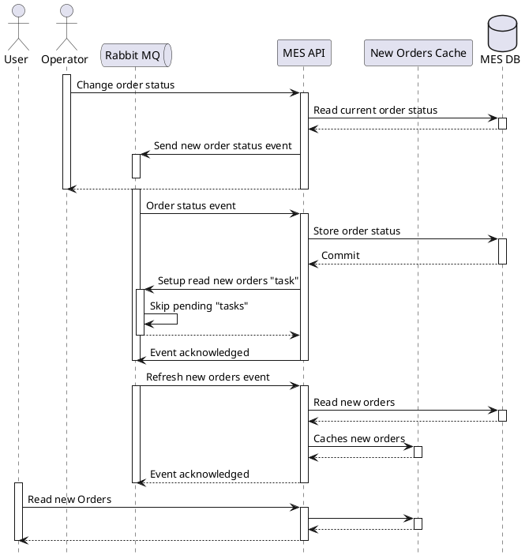

## Мотивация

Проблемы с долгой загрузкой страницы MES скорее всего связаны с большим количеством заказов в БД системы. Количество
коннектов к БД ограничено, потому каждый клиент системы MES ожидает своей очереди для поиска новых заказов. Чтобы
сократить нагрузку на БД, предлагается кешировать новые заказы на стороне приложения MES.

## Предлагаемое решение

Т.к. новые заказы поступают довольно часто, то кеширование на клиенте основанное на времени жизни кеша вряд-ли
поможет справиться с ситуацией, а только введет пользователей в заблуждение. Например, заказ давно уже взят в работу, но
кеш на клиенте показывает, что заказ всё еще новый. Время жизни кеша придется уменьшать, что будет сравнимо с текущей
ситуацией.

В данной ситуации лучше подойдет кеш на серверной стороне. Т.к. приложение работает нестабильно, и статусы заказов
теряются по не ясным пока причинам, то наиболее надежным источником состояния заказов является БД. Потому, чтобы
избежать еще большего хаоса и несогласованности данных кеша и БД, следует исключить такие паттерны кеширования как
Cache-Aside и Write-Through. Предлагает следовать паттерну Refresh-Ahead, это позволит обновлять данные одним
неконкурентным запросом, а пользователям видеть достаточно актуальные данные по новым заказам. Перезаписывать кеш
необходимо при смене статуса новых заказа, либо при появлении новых заказов.

Диаграмма работы кеша.

Дополнительно можно рассмотреть работу кеша по паттерну Write-Behind, удаляя и добавляя в него записи по ключу, но это
значительно усложнит реализацию необходимостью введения блокировок и отслеживания конкурентных изменений при обновлении
кеша на стороне MES API, а также необходимостью отслеживания статусов записи состояния в БД и отката изменений в кеше в
случае отказов. 
